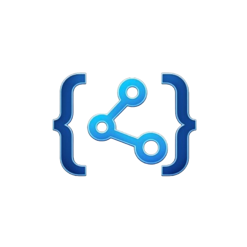

<p align="center">
  
</p>

<h1 align="center">DevConnect</h1>

<p align="center">
  Developer social network frontend - Angular SPA with session-based authentication against a Laravel API.
</p>

<p align="center">
  
  
  
  
</p>

<p align="center">
  
  
  
</p>

---

## Table of Contents

- [What is DevConnect?](#what-is-devconnect)
- [Features](#features)
- [Admin account management](#admin-account-management)
- [Security](#security)
- [Tech stack](#tech-stack)
- [Project structure](#project-structure)
- [Installation](#installation)
- [Tests](#tests)
- [Authentication flow](#authentication-flow)
- [Routes](#routes)
- [Deployment](#deployment)
- [Documentation](#documentation)

---

## What is DevConnect?

DevConnect is a developer-focused social network. This repository contains the Angular SPA that handles the public and authenticated user experience, while the Laravel API provides authentication, authorization, persistence, and API responses.

The frontend is built around stateful Sanctum sessions, so the browser authenticates with cookies and CSRF protection rather than storing tokens in `localStorage`.

---

## Features

- Register and log in with email or username
- Restore session state through `/api/auth/me`
- Protected routes enforced by Angular guards
- Profile pages for the owner and public users
- Editable profile data: headline, bio, skills, links, password
- Feed layout with tags, posts, comments, likes, follows, and user search
- Post detail pages and create/edit flows
- Home layout with header, sidebar, main feed, and right aside
- Shared confirmation modal for destructive actions
- Responsive behavior tuned for desktop, tablet, and mobile layouts
- Home sidebar Premium modal with a local informational flow

---

## Admin account management

The account tab in the profile includes a limited admin surface for users with the `admin` role.

It allows searching accounts by `@username` and deleting non-admin users from the profile account area. It is not a general admin console, only a focused account management tool.

The flow is covered by Cypress E2E in `cypress/e2e/profile/admin.cy.ts`.
The account flow is also reflected in the `profile` module documentation.

---

## Security

- No auth tokens in `localStorage` or `sessionStorage`
- Sanctum session auth with cookies and CSRF
- Frontend requests use credentials when talking to Laravel
- Generic login failure messages to reduce account enumeration
- Password changes are handled through the authenticated profile flow
- Sensitive actions go through confirmation UI before execution

---

## Tech stack

| Layer | Technology |
|------|------------|
| Frontend | Angular 21, Angular Router, Reactive Forms, RxJS, SCSS |
| Auth | Laravel Sanctum, cookies, CSRF |
| Testing | Cypress 14, Angular test runner, Vitest |
| Package manager | pnpm |
| Runtime config | `public/env.js` |
| Static deployment | Vercel |

---

## Project structure

```text
DevConnect-Frontend/
├── src/app/
│   ├── home/                 # Home shell, feed and post creation
│   ├── profile/              # Own and public profile screens
│   ├── guards/               # Route protection
│   ├── interceptors/         # CSRF and credentials handling
│   ├── services/             # API services and state helpers
│   └── shared/               # Shared UI pieces such as confirm modal
├── cypress/
│   ├── e2e/                  # End-to-end specs
│   └── support/              # Cypress support files
├── public/
│   ├── env.js                # Runtime browser config, no secrets
│   ├── fonts/
│   └── favicon.ico
└── vercel.json               # Static SPA deployment config
```

---

## Documentation

- [Docs index](./docs/README.md)
- [Architecture](./docs/ARCHITECTURE.md)
- [Testing](./docs/TESTING.md)
- [Deployment](./docs/DEPLOYMENT.md)
- [Home module](./src/app/home/README.md)
- [Profile module](./src/app/profile/README.md)

---

## Installation

### Requirements

| Tool | Minimum version |
|------|-----------------|
| Node.js | 22 |
| pnpm | 11 |
| Backend API | DevConnect Laravel API running locally or remotely |

### Local setup

```bash
pnpm install
pnpm dev
```

Default local URLs:

- Frontend: `http://127.0.0.1:4200`
- Backend API: `http://127.0.0.1:8001`

### Runtime configuration

Development defaults to `http://127.0.0.1:8001`.

Production builds require `VITE_API_URL` because `pnpm build` injects that value at build time. For Vercel deployments, use the frontend origin so browser requests stay same-origin and flow through the rewrites:

```bash
VITE_API_URL=https://devconnect-free.vercel.app pnpm build
```

After the app is built, `public/env.js` can still override the browser API origin at runtime:

```js
window.__DEVCONNECT_CONFIG__ = {
  apiUrl: 'https://devconnect-free.vercel.app',
};
```

`public/env.js` is public and must not contain secrets.

In deployed browsers, the checked-in `public/env.js` defaults to `window.location.origin`. That only works correctly when the hosting platform proxies `/api` and `/sanctum` to Laravel.

---

## Tests

```bash
pnpm test
pnpm cypress:open
pnpm cypress:run
pnpm e2e
pnpm e2e:local
```

Notes:

- `pnpm e2e` waits for the Angular dev server.
- `pnpm e2e:local` waits for both the frontend and the local Laravel API at `127.0.0.1:8001`.
- `CYPRESS_backendUrl` controls the API target when the backend is not on the default local port.
- `CYPRESS_browserBackendUrl` is needed when the browser-side API origin differs from `http://127.0.0.1:8001`.
- Admin specs use `CYPRESS_adminEmail` and `CYPRESS_adminPassword`.

---

## Authentication flow

```text
Angular -> GET /sanctum/csrf-cookie -> obtain XSRF-TOKEN
Angular -> POST /auth/login         -> send credentials + X-XSRF-TOKEN
Laravel -> validate and create session cookie
Angular -> all authenticated calls  -> withCredentials: true
Laravel -> verify session on protected routes
Angular -> GET /auth/me             -> restore session in guards
```

---

## Routes

- `/login`
- `/register`
- `/home`
- `/home/create-post`
- `/home/post/:id`
- `/profile`
- `/profile/:username`
- `/posts/:id`

Protected routes are guarded in Angular and enforced again by backend session checks.

---

## Deployment

### Docker

Lightweight frontend image for local execution and Cypress-oriented workflows.

### Vercel

Static SPA deployment is configured through `vercel.json`.

For the exact runtime config, `VITE_API_URL` requirement, Docker commands, and proxy behavior for `/api` and `/sanctum`, see [docs/DEPLOYMENT.md](./docs/DEPLOYMENT.md).

Build example:

```bash
VITE_API_URL=https://devconnect-free.vercel.app pnpm build
```

---
